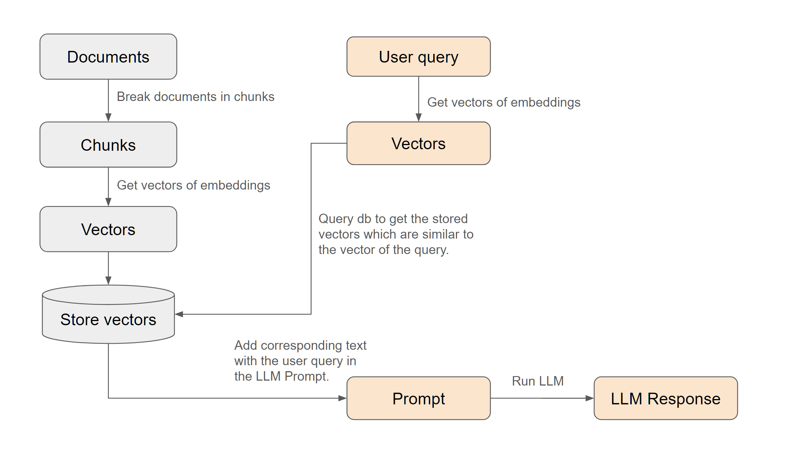

## <h1 align="center" id="heading">🔍Your First Retrieval Augmented Generation QA Application!</h1>

This repository contains the code for the "Your First Retrieval Augmented Generation QA Application" project.
This project is part of the AI Engineering Bootcamp from AI Makerspace.

### Steps to Run:

1. Create a Python 3.11 environment
2. `pip install jupyter` so you can run the notebook
3. `pip install -r requirements.txt` to install all the requirements

### RAQA explainer

Below is a simple diagram describing the RAQA process.

### Extras

The following extras were added to the original RAQA pipeline:
- Allowing it to work with PDF files using the 'pdfminer.six' library (further work has shown that the pdfplumber library would be a better choice but the change has not been implemented yet).
- A new distance metric (Approximate Nearest Neighbours - AAN) was implemented using the 'annoy' library.
- Metadata support was added to the vector database, but is only available when the list-based local storage (used by annoy) is used. As metadata, the KeyBERT library is used to extract keywords from the documents. 

